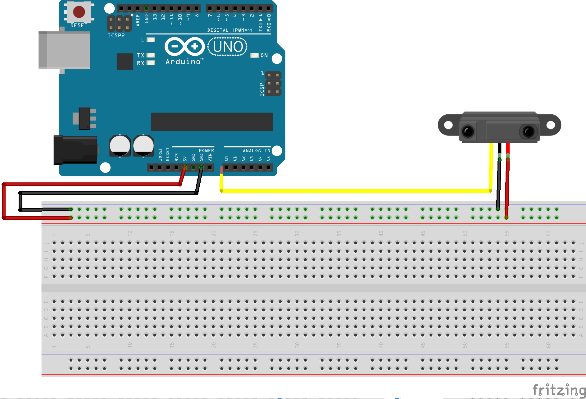

[Back to main page](README.md)

# Control video playback with a distance sensor

The first program will use a distance sensor and the distance detected by our sensor will be used to adjust the running speed of a video read by a processing program: 

<br>

As a reminder, the wiring of the distance sensor is as follows :

<br>

We will use the sample code provided in the processing video library. Available in the examples browser: *Exemples* -> *Libraries* -> *Video* -> *Movie* -> *Speed*

I advise you to open it from processing (as you already have the video and code), but the code looks like this with some comments.

```java
/**
 * Speed. 
 * Use the Movie.speed() method to change
 * the playback speed.
 */

import processing.video.*; // import the library video
Movie mov; // create a movie object called mov so you can load a movie and play it.

void setup() {
  size(640, 360);
  background(0);
  mov = new Movie(this, "transit.mov"); // load the movie "transit.mov" which is in the data folder of your sketch
  mov.loop(); // start looping the movie
}

void draw() {    
  image(mov, 0, 0); // display a frame of the movie
             
  // calculate a variable that will be used to control the movie's frame rate
  // this variable will depend on the mouse whose horizontal position is between 0 and 'width'
  // and we want to get values ​​between 0.1 and 2
  float newSpeed = map(mouseX, 0, width, 0.1, 2);
  mov.speed(newSpeed); // use our variable to change the speed of the movie
  
  // show the speed value on the top left
  fill(255);
  text(nfc(newSpeed, 2) + "X", 10, 30); 
}  

// function needed to trigger movie playback
void movieEvent(Movie movie) {
  mov.read();  
}

```
In this code we make the speed depend on the position of the mouse, so we will replace the variable * mouseX * on the line:

```java
float newSpeed = map(mouseX, 0, width, 0.1, 2);
```
by the value that we will capture via our distance sensor and arduino card. 

For this in our arduino code we will write a character string in the format [**JSON **](https://en.wikipedia.org/wiki/JSON) in which we will insert a value read from our analog input.

Our character string will have to look like this
```json
{
    "distance" : distance_value_measured_by_our_sensor
}
```

This arduino code makes it possible to do this with string concatenation.
```c
String json;
  json = "{\"distance\":";
  json = json + analogRead(0);
  json = json + "}";
```

We just have to post this character string on the serial port with **Serial.println ()** as usual. Here is the whole arduino code:

```c

void setup() {
  Serial.begin(9600);
}

void loop() {
  
  int value = analogRead(00);

  String json;
  json = "{\"distance\":";
  json = json + value;
  json = json + "}";

  Serial.println(json);
}
```
On the processing side, it is now necessary to start receiving this string of characters, to extract the distance data and to use it.

We will have to use the library [**Serial**](https://processing.org/reference/libraries/serial/index.html), it is not necessary to install it because it is integrated by default in processing.

We have to start by importing the library by typing at the very top of the sketch we use to read our film:
```java
import processing.serial.*;
Serial myPort;  //Create a serial object to read the information posted on the serial port
```
we will use it to create a variable intended to store the information received by arduino

```java
int valueFromArduino = 50;
int movieSpeed = 0;
```
Then we have to add some lines to the **setup()**: it is necessary to start the program initialize the serial connection with our arduino card.

```java
// initialization of communication via usb from arduino
// BE CAREFUL to use the adapted port
printArray(Serial.list()); //print the list of devices connected to the serial port
String portName = Serial.list()[3]; // my arduino card is the third in the list printed in the console
myPort = new Serial(this, portName, 9600); //we open the communication
myPort.bufferUntil('\n');
```

Now, we have to execute code every time information is posted on the serial port, this is done by writing it in a function:
```java
void serialEvent (Serial myPort) {
  
}
```

The code below is a little hard to get, but you do not have to understand everything. Basically we will try to read the data arriving on the serial port, if it is open, then we will decode our json string:

```java
void serialEvent (Serial myPort) {
  try { // we try to do something but we do not crash if we can not do it
    while (myPort.available() > 0) {
      String inBuffer = myPort.readStringUntil('\n'); // read the string from the serial port until the carriage return
      if (inBuffer != null) { // if it's not null
        if (inBuffer.substring(0, 1).equals("{")) { // and if it looks like json
          JSONObject json = parseJSONObject(inBuffer); // we try to read it like json
          
          // It is from here that one must understand !!
          if (json == null) { // if it's not json we do nothing
            
          }
          else { // else we get the value with the name 'distance' and we store it in a variable!
            if (abs(json.getInt("distance")-valueFromArduino)> 50) { // check that the value has changed enough
              valueFromArduino    = json.getInt("distance");
              // we map the value and store it in our movie speed variable created at the beginning
              movieSpeed = map(valueFromArduino, 50, 650, 2, 0);
              movieSpeed = constrain(movieSpeed, 0, 2); // keep this value in a consistent range of times that our sensor returns too large or too small values
            }
          }
        // we just have to close all our braces ^^
        } 
        else {
        }
      }
    }
  } 
  catch (Exception e) {
  }
}
```
There are a lot of security tests to prevent our program from crashing if our string is null or if the data we are looking for is not available.

But we only have to use *movieSpeed ​* to actually control the speed of the movie.

```java
mov.speed(movieSpeed);
```
Here is the processing code to retrieve the distance value from arduino and use it to control the speed of reading a movie:

```java

import processing.video.*;
Movie mov;


import processing.serial.*;
Serial myPort;  

int valueFromArduino = 50;
float movieSpeed = 2;

void setup() {
  size(800, 500);
  background(0);

  mov = new Movie(this, "transit.mov");
  mov.loop();

 // initialization of communication via usb from arduino
  // BE CAREFUL to use the adapted port
  printArray(Serial.list());
  String portName = Serial.list()[3];
  myPort = new Serial(this, portName, 9600);
  myPort.bufferUntil('\n');
}

void movieEvent(Movie movie) {
  mov.read();
}

void draw() {    
  image(mov, 0, 0,width,height);

  
  mov.speed(movieSpeed);

  fill(255);
  text(nfc(movieSpeed, 2) + "X", 10, 30);
}  

void serialEvent (Serial myPort) {
  try {
    while (myPort.available() > 0) {
      String inBuffer = myPort.readStringUntil('\n');
      if (inBuffer != null) {
        if (inBuffer.substring(0, 1).equals("{")) {
          JSONObject json = parseJSONObject(inBuffer);
          if (json == null) {
            //println("JSONObject could not be parsed");
          } else {
            if (abs(json.getInt("distance")-valueFromArduino)> 50) {
              valueFromArduino    = json.getInt("distance");
              movieSpeed = map(valueFromArduino, 50, 650, 2, 0);
              movieSpeed = constrain(movieSpeed, 0, 2);
            }
          }
        } else {
        }
      }
    }
  } 
  catch (Exception e) {
  }
}

```
[Back to main page](README.md)
