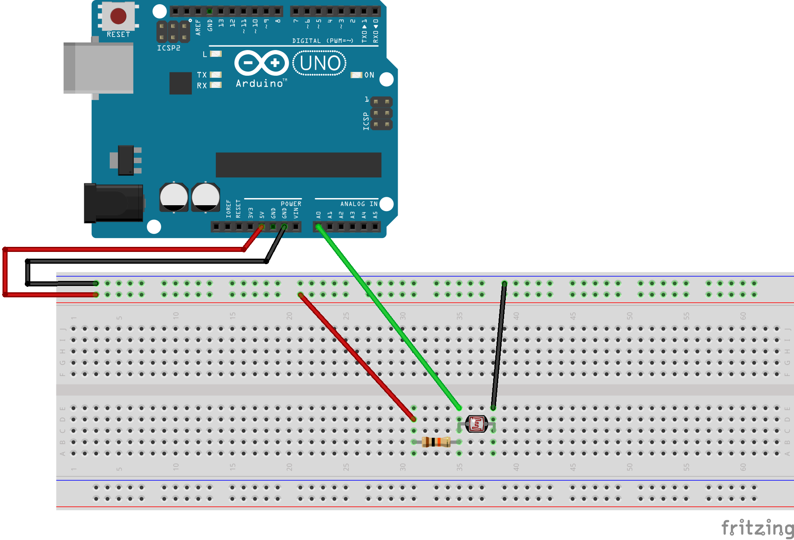

[Back to main page](README.md)

# Control an animation with a photoresistor

The logic of this animation is very similar to the previous one. We will replace the distance sensor with a photoresistor and we will use a different example:

<br>

The wiring is a photoresistor connected to A0.
<br>

The arduino code is almost the same, we will just adapt the identifier in our json that will store our value:

```c
void setup() {
  Serial.begin(9600);
}

void loop() {
  int value = analogRead(A0);
  String json;
  json = "{\"photores\":";
  json = json + value;
  json = json + "}";

  Serial.println(json);
}
```

From a processing point of view we will again use an example available with the software: *Examples* -> *Topics* -> *Fractals and L-Systems* -> *Tree*

```java
/**
 * Recursive Tree
 * by Daniel Shiffman.  
 * 
 * Renders a simple tree-like structure via recursion. 
 * The branching angle is calculated as a function of 
 * the horizontal mouse location. Move the mouse left
 * and right to change the angle.
 */
 
float theta;   

void setup() {
  size(640, 360);
}

void draw() {
  background(0);
  frameRate(30);
  stroke(255);
  // Let's pick an angle 0 to 90 degrees based on the mouse position
  float a = (mouseX / (float) width) * 90f;
  // Convert it to radians
  theta = radians(a);
  // Start the tree from the bottom of the screen
  translate(width/2,height);
  // Draw a line 120 pixels
  line(0,0,0,-120);
  // Move to the end of that line
  translate(0,-120);
  // Start the recursive branching!
  branch(120);

}

void branch(float h) {
  // Each branch will be 2/3rds the size of the previous one
  h *= 0.66;
  
  // All recursive functions must have an exit condition!!!!
  // Here, ours is when the length of the branch is 2 pixels or less
  if (h > 2) {
    pushMatrix();    // Save the current state of transformation (i.e. where are we now)
    rotate(theta);   // Rotate by theta
    line(0, 0, 0, -h);  // Draw the branch
    translate(0, -h); // Move to the end of the branch
    branch(h);       // Ok, now call myself to draw two new branches!!
    popMatrix();     // Whenever we get back here, we "pop" in order to restore the previous matrix state
    
    // Repeat the same thing, only branch off to the "left" this time!
    pushMatrix();
    rotate(-theta);
    line(0, 0, 0, -h);
    translate(0, -h);
    branch(h);
    popMatrix();
  }
}
```

In a similar way to the previous one, we can identify the relevant line for the interaction:
```java
// Let's pick an angle 0 to 90 degrees based on the mouse position
  float a = (mouseX / (float) width) * 90f;
```

So we will delete this line and 'replace' *mouseX* by a value coming from the photoresistance ... First, let's adapt the *serialEvent()* function used previously to retrieve the value from our arduino program:

- Let's first define a global variable that will store our value:
```java
float valueFromArduino = 0;
```

- Then let's adapt the *serialEvent()* function to store in *valueFromArduino* the value coming from arduino by using the right key, the very one we defined in our arduino program (ie 'photores'):
```java
void serialEvent (Serial myPort) {
  try {
    while (myPort.available() > 0) {
      String inBuffer = myPort.readStringUntil('\n');
      if (inBuffer != null) {
        if (inBuffer.substring(0, 1).equals("{")) {
          JSONObject json = parseJSONObject(inBuffer);

          if (json == null) {
            //println("JSONObject could not be parsed");
          } else {
            valueFromArduino    = json.getInt("photores");
          }

        } else {
        }
      }
    }
  } 
  catch (Exception e) {
  }
}
```
We only have to use this value by mapping it to a visually relevant value range
```java
theta = map(valueFromArduino, 15, 250, 0, PI);
```
So here is finally the entire processing program:

```java
/**
 * hacked from
 * Recursive Tree
 * by Daniel Shiffman.  
 * 
 * and acousteauphone-prototype from lesporteslogiques
 * by Pierre Commenge
 */

import processing.serial.*;
Serial myPort;  // Create object from Serial class

float valueFromArduino = 0;
float theta;   

void setup() {
  size(640, 360);

 // initialization of communication via usb from arduino
  // BE CAREFUL to use the adapted port
  printArray(Serial.list());
  String portName = Serial.list()[3];
  myPort = new Serial(this, portName, 9600);
  myPort.bufferUntil('\n');
}

void draw() {
  background(0);
  frameRate(30);
  stroke(255);


  // Convert it to radians
  theta = map(valueFromArduino, 15, 250, 0, PI);
  // Start the tree from the bottom of the screen
  translate(width/2, height);
  // Draw a line 120 pixels
  line(0, 0, 0, -120);
  // Move to the end of that line
  translate(0, -120);
  // Start the recursive branching!
  branch(120);
}

void serialEvent (Serial myPort) {
  try {
    while (myPort.available() > 0) {
      String inBuffer = myPort.readStringUntil('\n');
      if (inBuffer != null) {
        if (inBuffer.substring(0, 1).equals("{")) {
          JSONObject json = parseJSONObject(inBuffer);
          if (json == null) {
            //println("JSONObject could not be parsed");
          } else {
            valueFromArduino    = json.getInt("photores");
          }
        } else {
        }
      }
    }
  } 
  catch (Exception e) {
  }
}

void branch(float h) {
  // Each branch will be 2/3rds the size of the previous one
  h *= 0.66;

  // All recursive functions must have an exit condition!!!!
  // Here, ours is when the length of the branch is 2 pixels or less
  if (h > 2) {
    pushMatrix();    // Save the current state of transformation (i.e. where are we now)
    rotate(theta);   // Rotate by theta
    line(0, 0, 0, -h);  // Draw the branch
    translate(0, -h); // Move to the end of the branch
    branch(h);       // Ok, now call myself to draw two new branches!!
    popMatrix();     // Whenever we get back here, we "pop" in order to restore the previous matrix state

    // Repeat the same thing, only branch off to the "left" this time!
    pushMatrix();
    rotate(-theta);
    line(0, 0, 0, -h);
    translate(0, -h);
    branch(h);
    popMatrix();
  }
}
```

[Back to main page](README.md)

