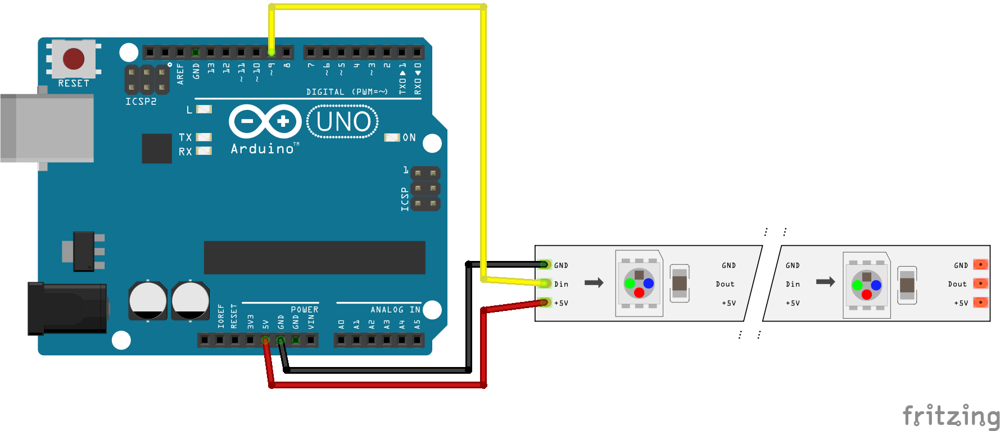

[Back to main page](README.md)

# Control neopixels leds with the mouse

This third example will illustrate the reverse communication: we will send data from processing to arduino. Depending on the position of the mouse the color of the window will be affected and these mouse positions will also be sent to arduino to control the lighting of leds.

<br>

The electrical diagram is simple: it is about connecting a ribbon of LEDs on an arduino card:

<br>

The processing program will use the HSB mode to adjust the hue according to the position on the absciss of the mouse, the saturation according to the ordinate position of the mouse and the brightness according to the state of the mouse (is it whether the button is pressed or not?) This data will be mapped to processing and written to the serial port for reuse in arduino. We will send 3 values, these values ​​will be separated by commas and we will use a semicolon to mark the end of a data packet.

```java
import processing.serial.*;

Serial myPort;  

void setup() {
  size(600, 600); 
  colorMode(HSB,255,255,255);
  // initialize the serial library
  println(Serial.list());
  String portName = Serial.list()[3]; // be careful to use the correct port
  myPort = new Serial(this, portName, 9600);
}

void draw() {
  int pressed = 0;
  if (mousePressed == true) {    
    pressed = 1;         
  } else {                         
    pressed = 0; 
  }  
  int x =int( map(mouseX, 0, width, 0, 255));
  int y =int( map(mouseY, 0, height, 0, 255));
             
  background(x, y, pressed*255);
             
  String s = pressed+","+x+","+y+";";
  println(s);
  myPort.write(s);
}
```
The arduino code will be much more complex than usual, but it is not necessary to understand everything. You can refer to [the original post](http://www.esologic.com/parsing-serial-data-sent-to-arduino/) of the code I use here.

The part we are going to manipulate is located inside *else* in the loop function

```c
// from http://www.esologic.com/parsing-serial-data-sent-to-arduino/

// code needed for receiving and retrieving data from processing
const char EOPmarker = ';'; //This is the end of packet marker
char serialbuf[32]; //This gives the incoming serial some room. Change it if you want a longer incoming.
#include <string.h> // we'll need this for subString
#define MAX_STRING_LEN 20 // like 3 lines above, change as needed.

// code necessary for the operation of leds
#include <FastLED.h>
#define NUM_LEDS 5
CRGBArray<NUM_LEDS> leds;

void setup() {
 
  Serial.begin(9600);
  FastLED.addLeds<NEOPIXEL, 9>(leds, NUM_LEDS);
}

void loop() {
    
  if (Serial.available() > 0) { //makes sure something is ready to be read
    // this part of code allows you to recompose the message from processing
    static int bufpos = 0; //starts the buffer back at the first position in the incoming serial.read
    char inchar = Serial.read(); //assigns one byte (as serial.read()'s only input one byte at a time
    if (inchar != EOPmarker) { //if the incoming character is not the byte that is the incoming package ender
      serialbuf[bufpos] = inchar; //the buffer position in the array get assigned to the current read
      bufpos++; //once that has happend the buffer advances, doing this over and over again until the end of package marker is read.
    }

    // inside this else we can recover our values ​​and use them
    else { //once the end of package marker has been read
      serialbuf[bufpos] = 0; //restart the buff
      bufpos = 0; //restart the position of the buff

      int pressed = atoi(subStr(serialbuf, ",", 1)); // get the first value and store it in a variable
      int x = atoi(subStr(serialbuf, ",", 2)); // get back the second ...
      int y = atoi(subStr(serialbuf, ",", 3)); // get back the third ...
        
     // turn on the leds according to our values
      for (int i = 0; i < NUM_LEDS; i++) {
        leds[i] = CHSV(x, y, pressed *255);
      }
      FastLED.show();

    }
  }
}

// this function is necessary to allow to cut the string from processing
char* subStr (char* input_string, char *separator, int segment_number) {
  char *act, *sub, *ptr;
  static char copy[MAX_STRING_LEN];
  int i;
  strcpy(copy, input_string);
  for (i = 1, act = copy; i <= segment_number; i++, act = NULL) {
    sub = strtok_r(act, separator, &ptr);
    if (sub == NULL) break;
  }
  return sub;
}
```

[Back to main page](README.md)
